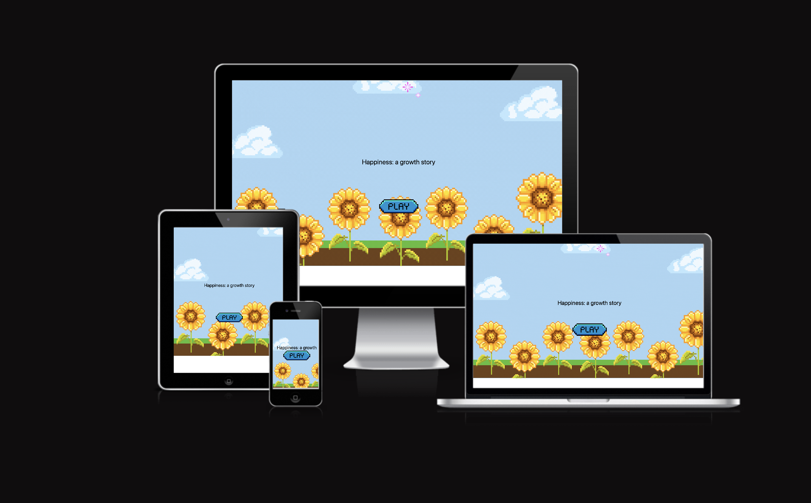
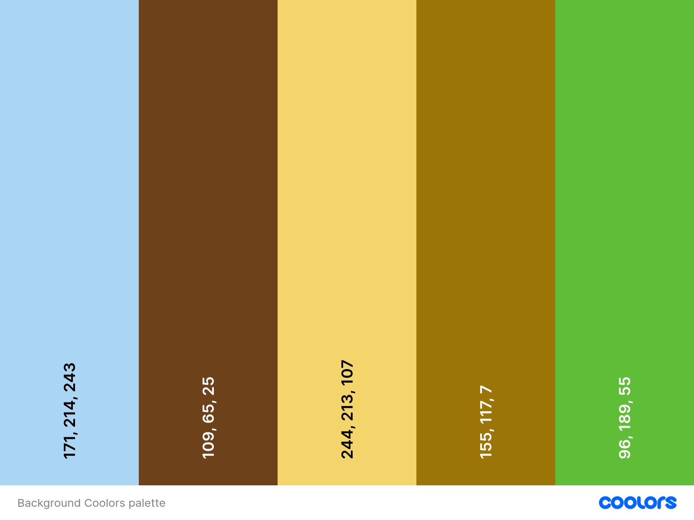
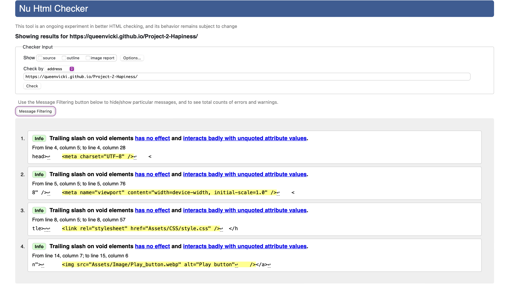
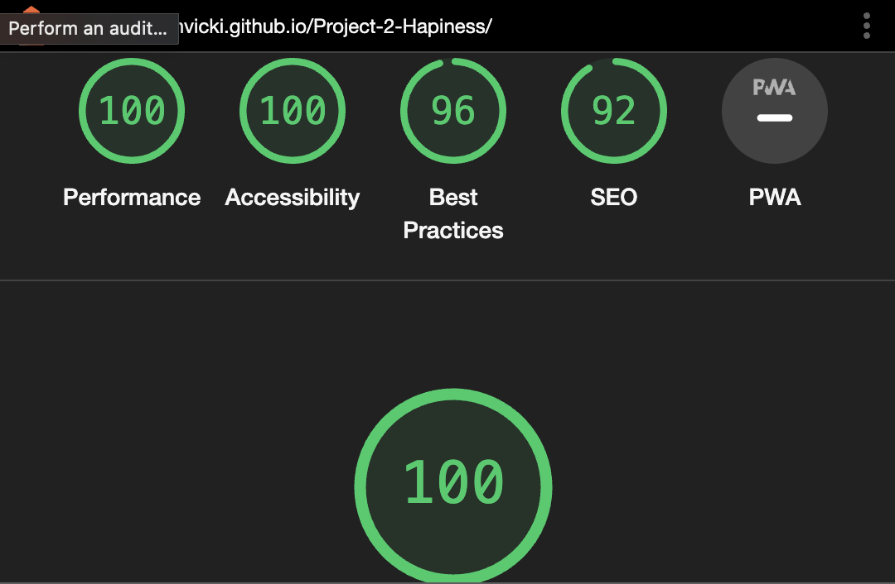

# Project-2-Hapiness

Website 🔗: https://queenvicki.github.io/Project-2-Hapiness/

<h2> Aim </h2>
As a lover of retro games, the main aim of this game was to replicate this and make it so that it can be enjoyed by any age that loves any sort of retro games.

<h2> About: </h2>
This is a game with questions and a game of 'Whac a mole', all done mostly.
The game has 2 levels,it starts off with a series of questions and if the player gets up to '4' points on the first level, they can move up to Level 2.
<ol>
<li> Level 1 was inspired by discussion and lack of inspiration my college professor and my friend Ife.</li>
<li> Level 2 was inspired by Kenny Yip Coding, I found his tutorial on youtube which helped serve some of my ideas for the level 2 that I had in mind:</li>
<ul>
    <li>Github - https://github.com/ImKennyYip</li>
    <li>Youtube tutorial used - https://youtu.be/ej8SatOj3V4?list=PLnKe36F30Y4bLhA-st9sC4ZthyV7nsL2Q</li>
</ul>
</ol>

<h2> Audience </h2>
Any age that appreciates retro games and sounds would like this game.

<h2>Color scheme </h2>
I went with a bright colour pastel theme that went with the sunflower theme (provided by the Coolors website).

<h2>Languages Used:</h2>

HTML5, CSS3, JavaScript

<h2> Wireframes </h2>
These were created directly in Canva:

<h2> Known issues/Future development: </h2>
<ul>
<li> In level 2, the gem and heart sometimes get stuck and don't move from their pipes, this may have been fixed but is a known issue</li>
<li> The responsiveness on the pages aren't great but this was being worked on and will be used for future development</li>
</ul>

<h2> Reports and checks </h2>
W3 Validator:

Lighthouse:

<h2> Final notes </h2>
I wanted to share thanks to the following for helping me complete this project 
<ol>
<li> My Course instructor Komal Karir for helping encourage me throughout </li>
<li> Kevin Yip for his tutorial on the 'Whac a mole'</li>
<li> Canva and their inspiration through the design:</li>
<ul>
    <li> the design 'Blue Colorful Retro Vintage Illustrated Game Pixel Art Animated Presentation' was used as inspiration for a lot of the pieces used in the game. </li>
</ul>
</ol>
